# T1A2 - Portfolio, Wade Doolan

## Access

-  My portfolio is hosted here: https://wade008.github.io/

- The code for my portfolio site can be accessed here: https://github.com/Wade008/Wade008.github.io

## Purpose  
The purpose of my portfolio website is to showcase my technical skills and abilities in relation to web development along with my current experience as a data analyst. The portfolio website also:
-  Outlines some of my interests outside of work, with the aim of highlighting my key personality traits.  
- Provides several contact methods to make it easy for a prospective employer to contact me.

## Target Audience
My portfolio website is mainly targeted towards prospective employers, but also aims to promote my skills and interests to the broader coding community. 

## Site functionality and features  
My portfolio website is designed to be full responsive and caters for mobile, tablet and web browser screen sizes. The site also has a responsive and interactive navigation bar, designed to facilitate navigation across the site's pages.

Specifically, the site responds to the screen sizes listed below:
- Mobile screens less than or equal to 768px
- Tablet screens greater than 768px and less than or equal to 1200px
- Desktop screens greater than 1200px  

Note, the site also uses Flexbox, which allows the site to dynamically respond to a broad spectrum of screens sizes.

Furthermore, the portfolio site provides access to multiple external sources, including my resume, my GitHub repo and my profiles on several social media sites (screenshot of these external sites are listed at the end of this document).

The portfolio site consists of five main areas (pages), including:
- A home page, which provides a brief introduction and broad descriptions of my technical skills.
- A professional experience page, which showcases three key professional achievements and access to my full resume.
- An interests page, outlining my main hobbies outside of work.   
- A professional blogs page, showing my top five blogs relating to my coding skills.
- A contact page, providing readers with multiple ways to get in touch with me.

In terms of accessibility, my portfolio website has been developed using semantic HTML tags and descriptive title and alt attributes where required. My site was tested using the Google Lighthouse. The score is shown below:
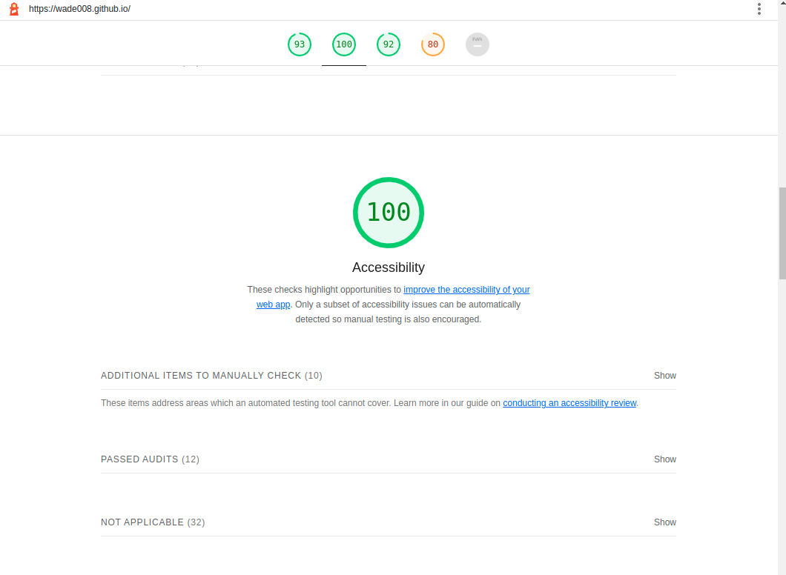

## Tech stack
The site is build using the following technologies:
- HTML5, 
- CSS and CSS pre-processor, SASS
- JavaScript
- Deployed through GitHub pages

## Sitemap

The sitemap for my portfolio site is shown below:

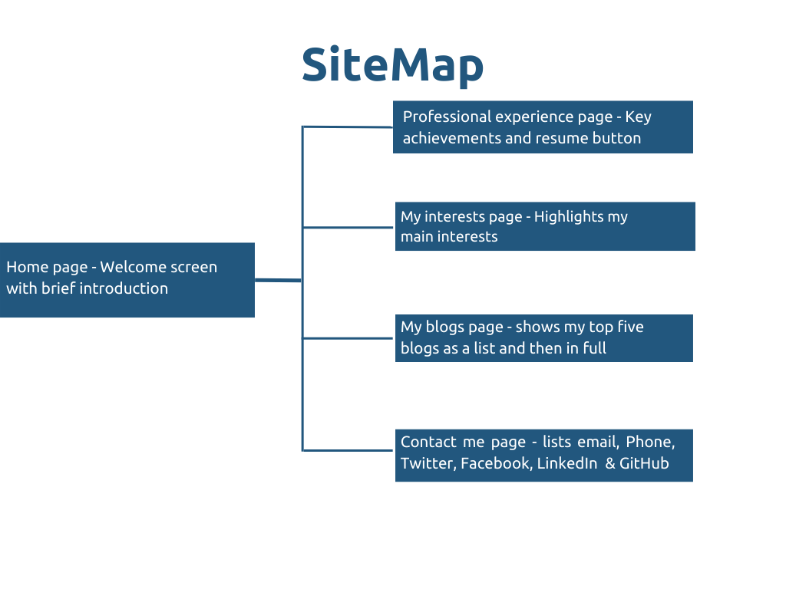

## Site Screenshots
Screenshots of my portfolio site are listed below.
### Home page
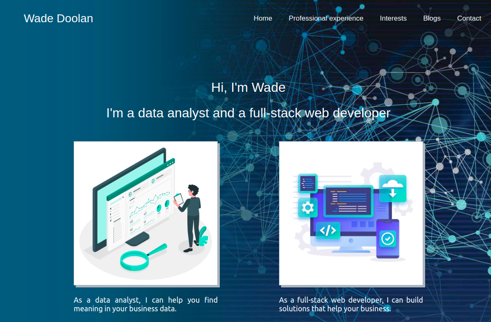

### Professional experience page
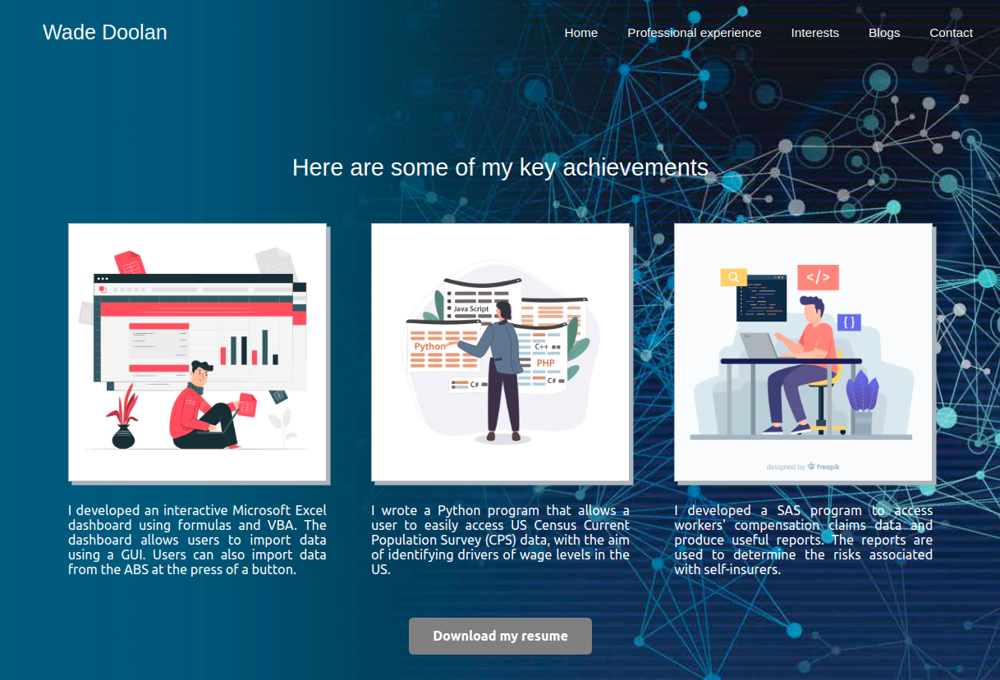

### Interests page
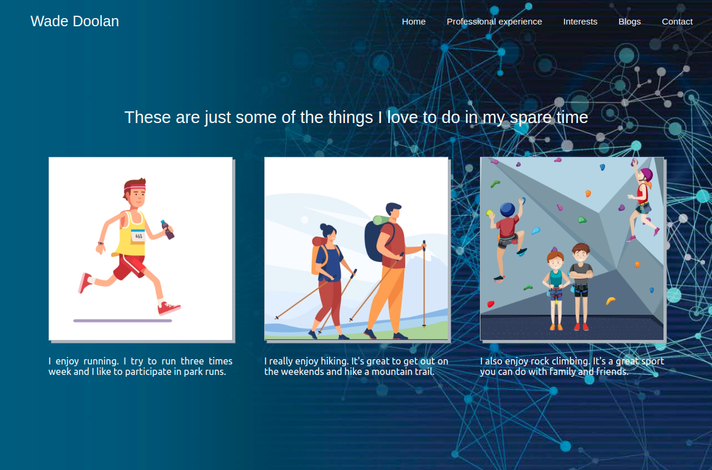

### Blogs page
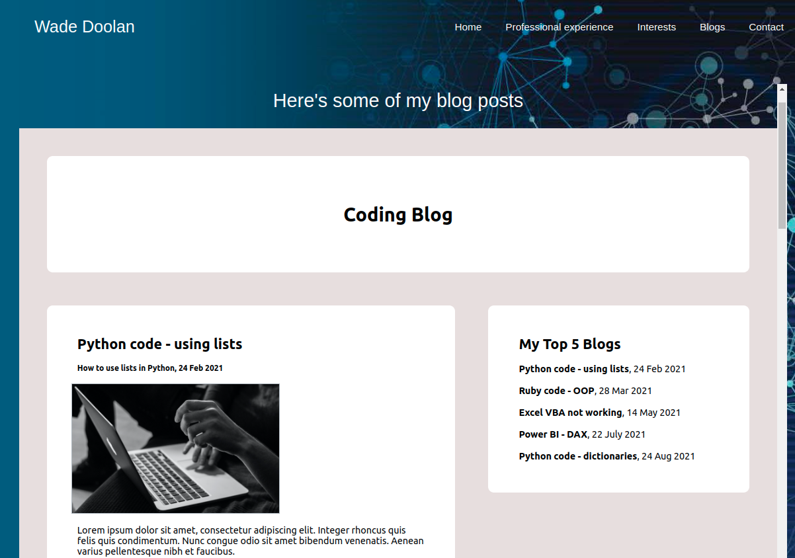

### Contact page
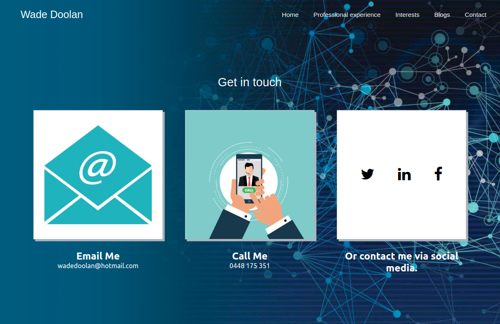

## Wireframes  
Images of my wireframes are listed below.

### Mobile design

### Tablet design

### Browser design

## External Sites (accessed from Portfolio site)  

## GitHub
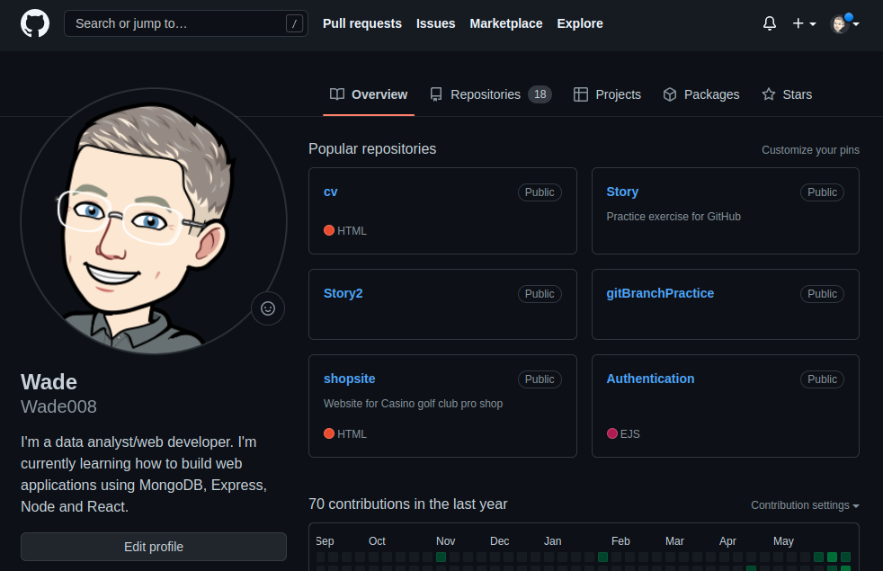

## LinkedIn
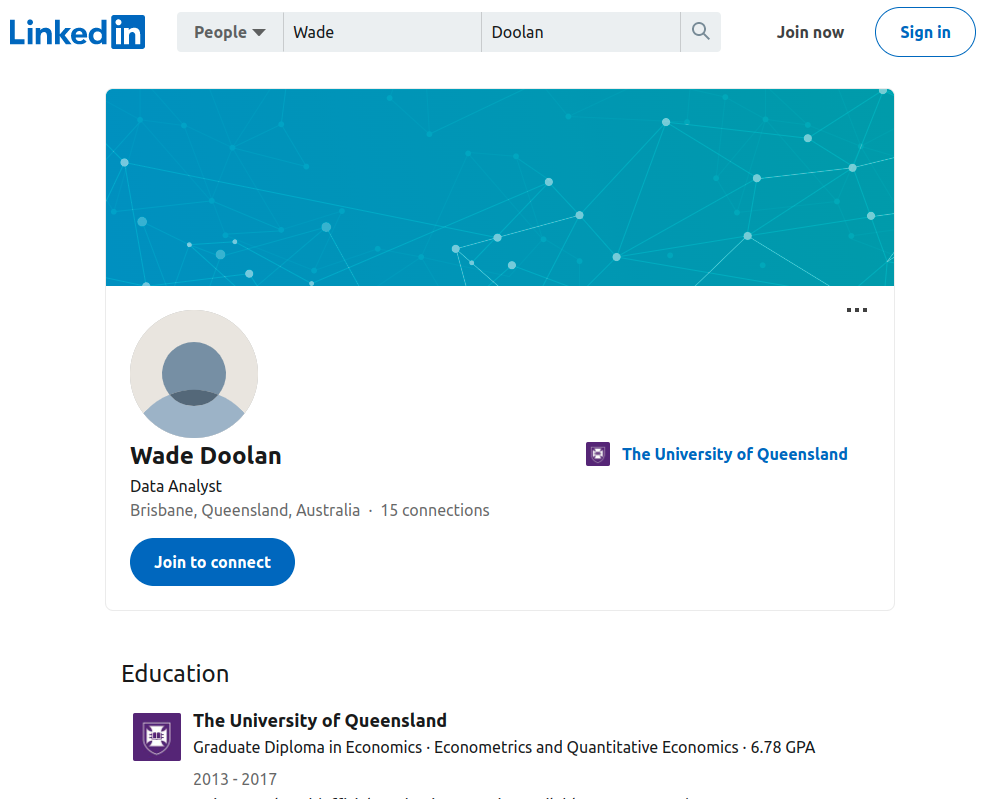

## Twitter
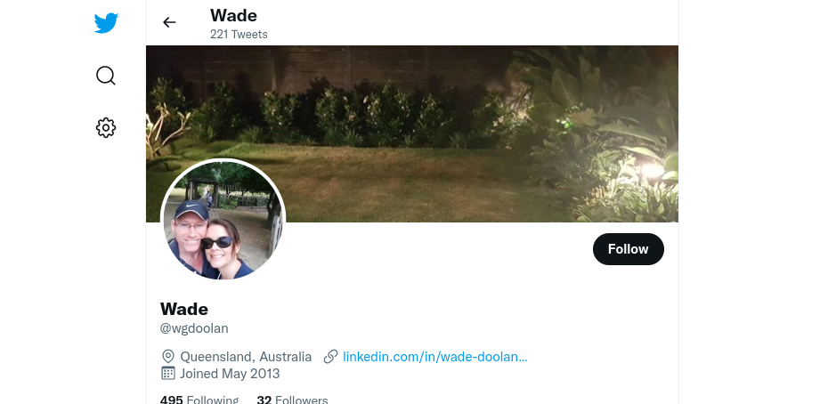

## Facebook
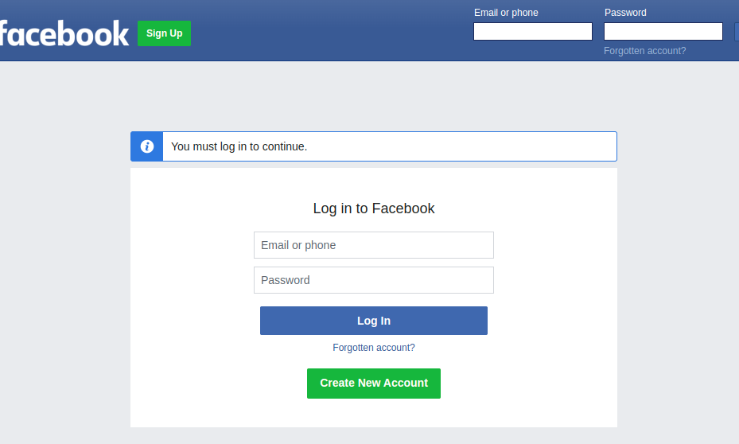

